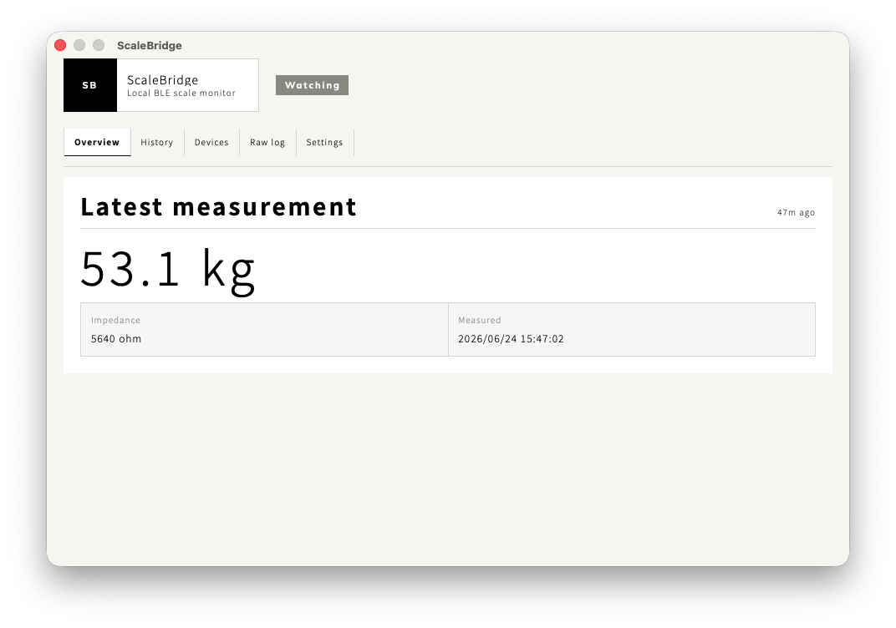
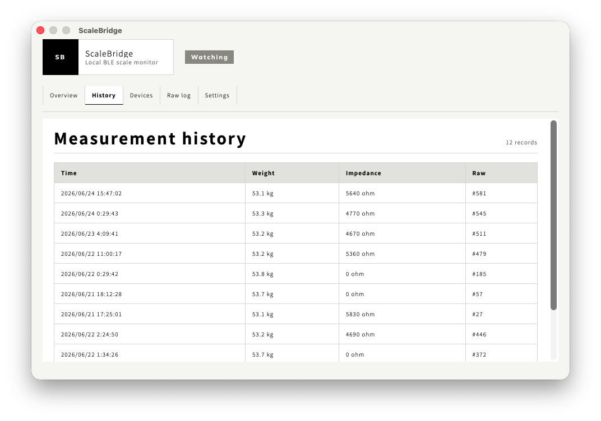
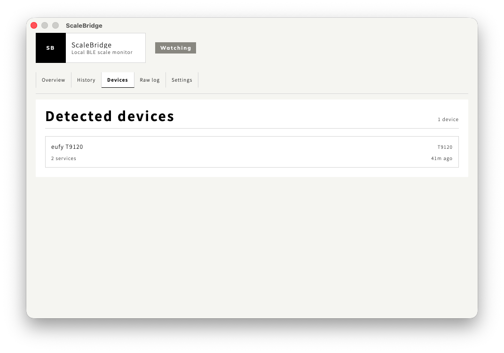

# ScaleBridge

<!-- rumdl-disable MD033 -->
<p align="center">
  
</p>
<!-- rumdl-enable MD033 -->

ScaleBridge is a local-first macOS menu bar app for collecting BLE scale
measurements from supported eufy smart scales.

It watches for a scale in the background, connects when the scale wakes up,
stores measurements and raw packets in SQLite, and opens the dashboard only
when you ask for it from the menu bar.

## Screenshots

| Overview                                                                         | History                                                               | Devices                                                           |
| -------------------------------------------------------------------------------- | --------------------------------------------------------------------- | ----------------------------------------------------------------- |
|  |  |  |

## Features

- Background BLE watcher for supported eufy scale profiles.
- macOS menu bar app with an on-demand Tauri window.
- Local SQLite storage for measurements, detected devices, and raw packets.
- Shared Rust core used by both the desktop app and debugging CLI.
- Raw packet capture for parser fixes and future device support.
- No cloud login, server sync, or official account API dependency.

## Support Status

ScaleBridge is currently focused on the T9120 protocol family.

| Device family          | Status    | Notes                                                                             |
| ---------------------- | --------- | --------------------------------------------------------------------------------- |
| `eufy T9120`           | Confirmed | Live measurements have been verified on hardware.                                 |
| `eufy T9146` / `T9147` | Candidate | Expected to share the T9120-style profile, but not yet verified.                  |
| Other eufy BLE scales  | Research  | Devices and raw packets are logged so new profiles can be added without guessing. |

See [docs/protocol.md](docs/protocol.md) for the protocol notes and supported
GATT profile details.

## Getting Started

Requirements:

- macOS 13 or newer.
- Rust 1.85 or newer.
- pnpm 11.4.0 or newer.
- Xcode Command Line Tools.

Install dependencies:

```sh
pnpm install
```

Run the desktop app in development:

```sh
pnpm tauri:dev
```

Build the macOS app bundle and DMG:

```sh
pnpm tauri:build
```

## CLI

The debugging CLI uses the same Rust BLE core as the desktop app.

Watch for scale events without writing a database:

```sh
cargo run -p scalebridge-cli -- watch --no-db
```

Watch and persist events to a local SQLite database:

```sh
cargo run -p scalebridge-cli -- watch --db ./scalebridge.sqlite
```

Parse a captured notification packet:

```sh
cargo run -p scalebridge-cli -- parse --hex "cf e8 12 b4 14 b3 b6 9f 00 00 0f"
```

## Architecture

```text
src/                         Tauri frontend and dashboard UI
src-tauri/                   macOS app shell, menu bar, autostart, commands
crates/scalebridge-core/     BLE scan/connect, GATT I/O, protocol parsing
crates/scalebridge-storage/  SQLite schema and repository layer
crates/scalebridge-cli/      Stdio debugging CLI
docs/                        Protocol and implementation notes
```

The frontend talks to the Rust backend through Tauri commands and events. BLE
scanning, packet parsing, storage, and macOS integration stay on the Rust side.

## Privacy

ScaleBridge is local-first. Measurements, device records, and raw BLE packets
are stored on your Mac by default. The app does not require a cloud account and
does not sync data to a server.

## Documentation

- [Implementation spec](docs/spec.md)
- [BLE protocol notes](docs/protocol.md)

## License

Apache-2.0
